# JCI Kuala Lumpur Platform - UI/UX 架构示例图

## 📐 系统架构概览

本文档详细描述了 JCI Kuala Lumpur 管理平台的 UI/UX 架构设计，包括组件层次结构、数据流、状态管理和用户交互模式。

---

## 🏗️ 应用架构层次图

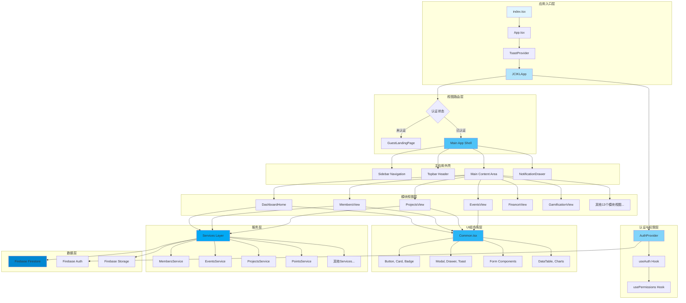

---

## 🎨 UI 组件层次结构

```mermaid
graph TD
    subgraph "基础UI组件 (components/ui/Common.tsx)"
        A1[Button<br/>variants: primary, secondary, outline, ghost, danger<br/>sizes: sm, md, lg]
        A2[Card<br/>title, action, noPadding]
        A3[Badge<br/>variants: success, warning, error, info, neutral, jci, gold, platinum]
        A4[Modal<br/>sizes: sm, md, lg, xl]
        A5[Drawer<br/>position: left, right]
        A6[ToastProvider<br/>Context-based notification system]
        A7[Tabs<br/>Tab navigation component]
        A8[ProgressBar<br/>Progress indicator]
        A9[StatCard<br/>Statistics display card]
        A10[AvatarGroup<br/>User avatars display]
    end

    subgraph "表单组件 (components/ui/Form.tsx)"
        B1[Input<br/>label, error, icon, helperText]
        B2[Select<br/>label, options, error]
        B3[Textarea<br/>label, error, helperText]
        B4[Checkbox<br/>label, error]
        B5[RadioGroup<br/>label, options, value, onChange]
    end

    subgraph "数据展示组件"
        C1[DataTable<br/>Sortable, filterable table]
        C2[Loading<br/>Loading states]
        C3[Responsive<br/>Responsive utilities]
        C4[Charts<br/>Recharts integration]
    end

    subgraph "认证组件 (components/auth/)"
        D1[LoginModal<br/>Email/Password, Google OAuth]
        D2[RegisterModal<br/>User registration form]
    end

    subgraph "仪表板组件 (components/dashboard/)"
        E1[MemberGrowthChart<br/>Member analytics]
        E2[PointsDistributionChart<br/>Points analytics]
        E3[BoardDashboard<br/>Board member dashboard]
    end

    A1 --> F[模块视图使用]
    A2 --> F
    A3 --> F
    A4 --> F
    A5 --> F
    A6 --> F
    B1 --> F
    B2 --> F
    B3 --> F
    C1 --> F
    C2 --> F
    C4 --> F

    style A1 fill:#e3f2fd
    style A2 fill:#e3f2fd
    style A3 fill:#e3f2fd
    style B1 fill:#f3e5f5
    style B2 fill:#f3e5f5
    style C1 fill:#fff3e0
    style D1 fill:#e8f5e9
    style E1 fill:#e0f2f1
```

---

## 🔄 数据流架构

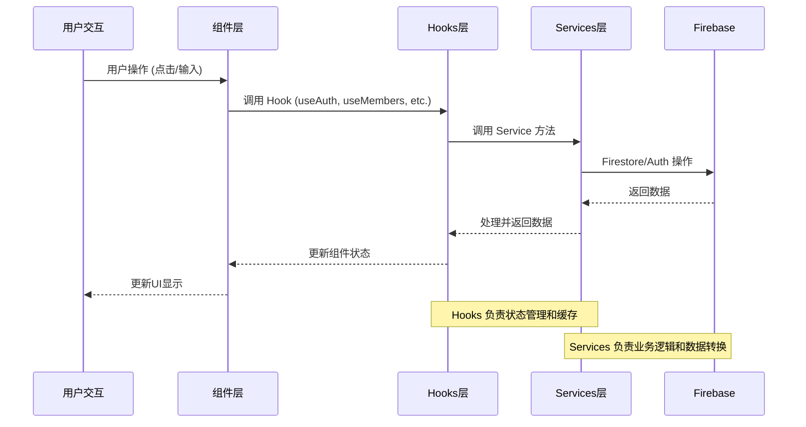

---

## 🗂️ 模块视图结构

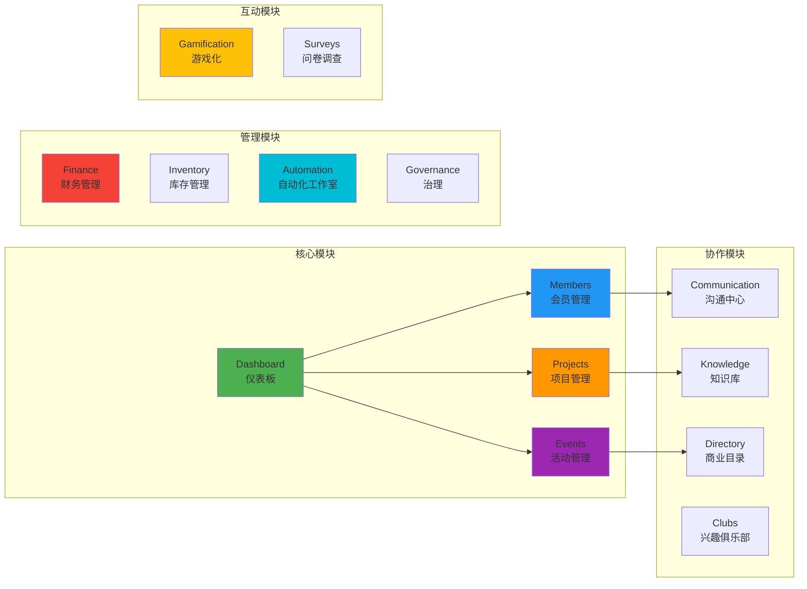

---

## 🎯 视图切换机制

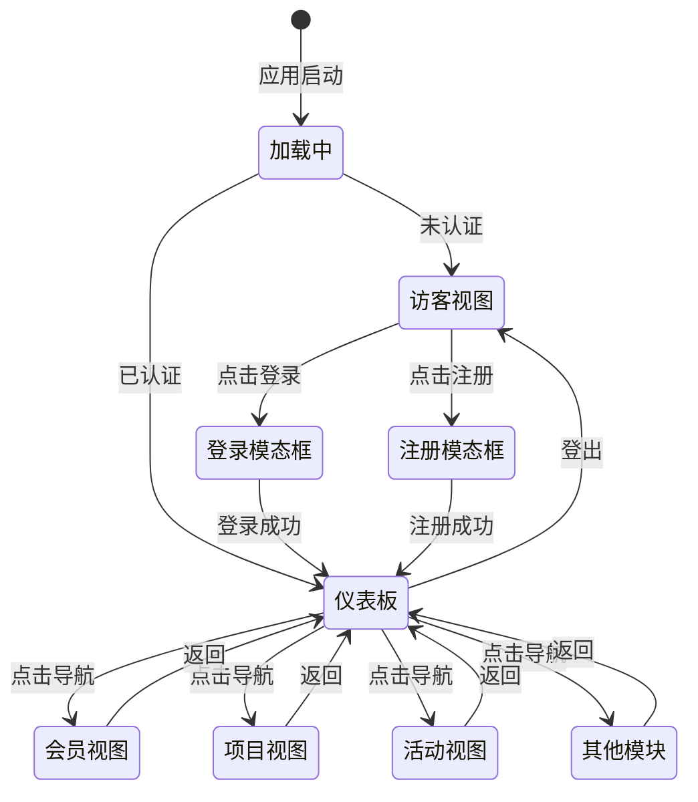

---

## 🔐 权限控制架构

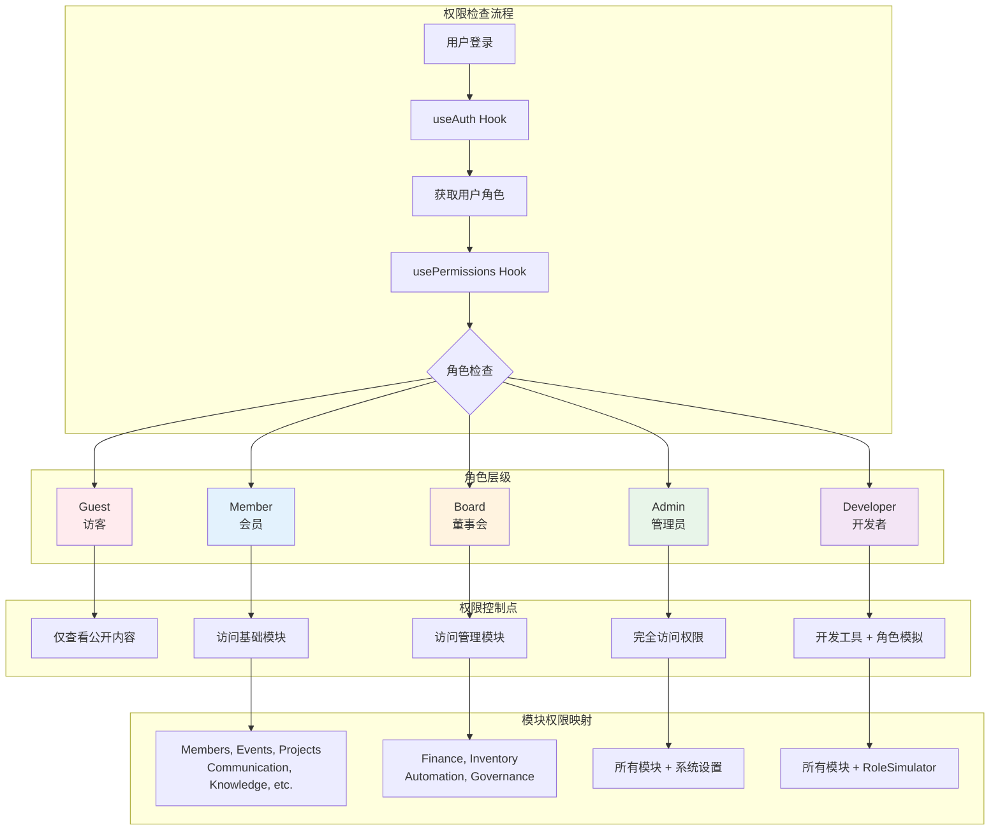

---

## 📱 响应式布局架构

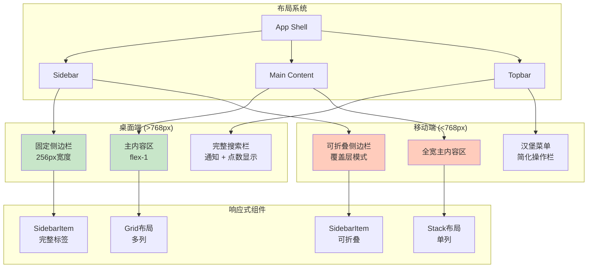

---

## 🎨 设计系统架构

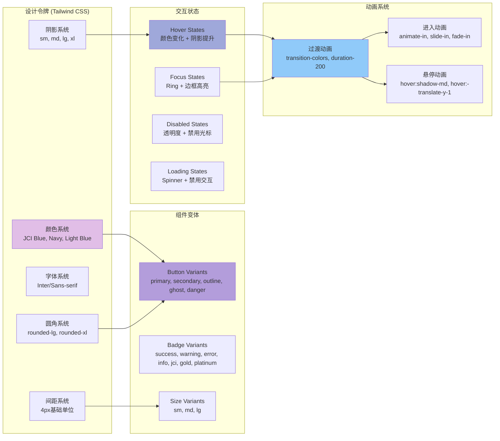

---

## 🔔 通知系统架构

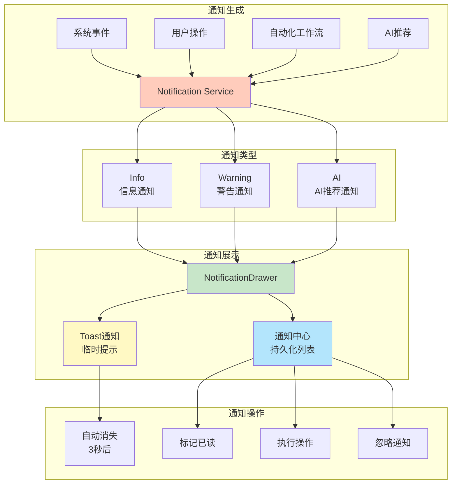

---

## 📊 状态管理架构

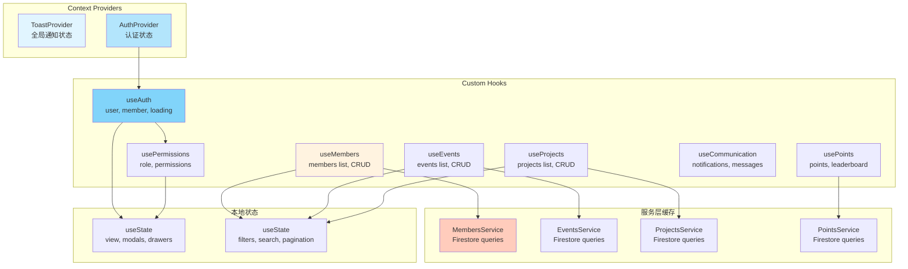

---

## 🎯 用户交互流程示例

### 示例1: 会员注册流程

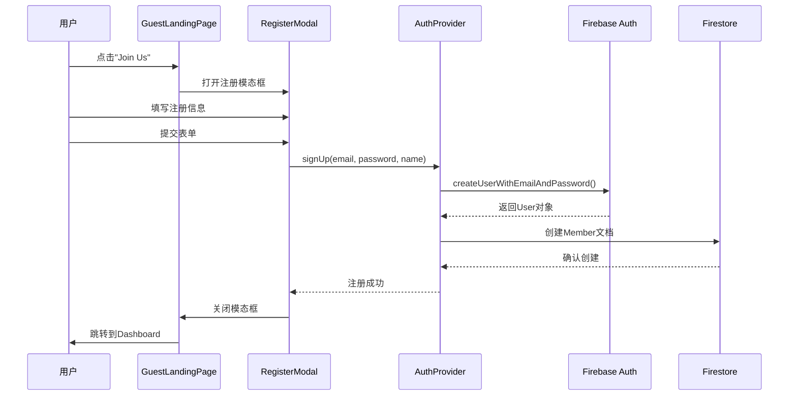

### 示例2: 查看会员列表流程

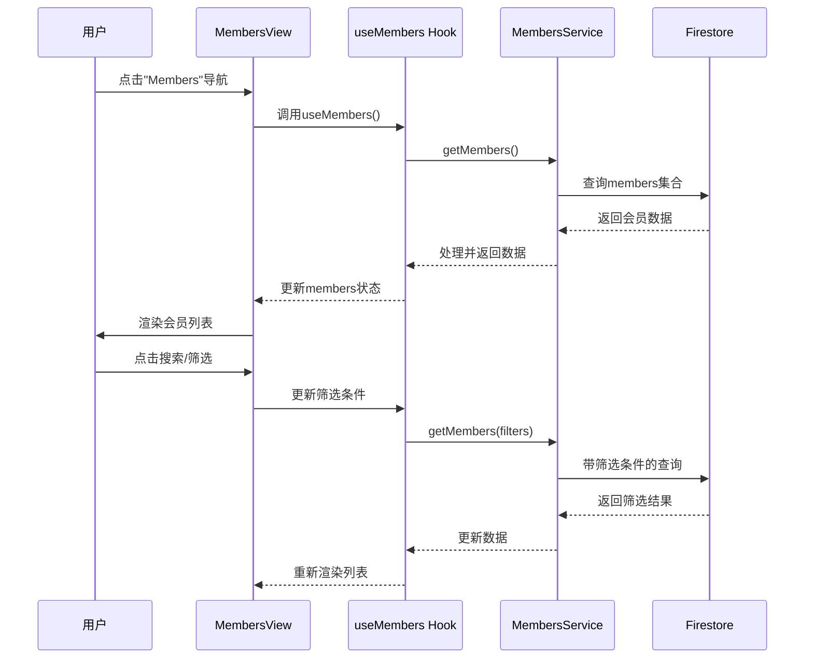

---

## 🛠️ 技术栈总结

### 前端框架
- **React 19.2.1** - UI框架
- **TypeScript 5.8.2** - 类型安全
- **Vite 6.2.0** - 构建工具

### 样式系统
- **Tailwind CSS 3.4.17** - 实用优先的CSS框架
- **PostCSS** - CSS处理
- **自定义设计令牌** - JCI品牌色彩系统

### UI组件
- **自定义组件库** - 基于Tailwind的组件系统
- **Lucide React** - 图标库
- **Recharts** - 图表库

### 状态管理
- **React Context API** - 全局状态
- **Custom Hooks** - 业务逻辑封装
- **本地useState** - 组件级状态

### 后端服务
- **Firebase Firestore** - 数据库
- **Firebase Authentication** - 认证服务
- **Firebase Storage** - 文件存储

---

## 📝 架构设计原则

### 1. 组件化设计
- **原子组件**: Button, Input, Badge等基础组件
- **分子组件**: Card, Modal, Form等组合组件
- **有机体组件**: DataTable, Chart等复杂组件
- **模板组件**: Dashboard, View等页面级组件

### 2. 关注点分离
- **UI组件**: 纯展示逻辑，无业务逻辑
- **Hooks**: 状态管理和副作用处理
- **Services**: 业务逻辑和数据操作
- **Types**: 类型定义和接口规范

### 3. 可复用性
- **通用组件库**: 所有模块共享的基础组件
- **自定义Hooks**: 可复用的业务逻辑
- **服务层抽象**: 统一的数据访问接口

### 4. 可维护性
- **TypeScript**: 类型安全，减少错误
- **模块化结构**: 清晰的文件夹组织
- **单一职责**: 每个组件/函数只做一件事

### 5. 用户体验
- **响应式设计**: 适配各种屏幕尺寸
- **加载状态**: 清晰的加载反馈
- **错误处理**: 友好的错误提示
- **无障碍性**: 键盘导航和屏幕阅读器支持

---

## 🚀 未来架构演进方向

### 短期优化
- [ ] 引入路由库 (React Router) 支持URL导航
- [ ] 实现虚拟滚动优化长列表性能
- [ ] 添加骨架屏提升加载体验
- [ ] 完善错误边界和错误恢复机制

### 中期改进
- [ ] 引入状态管理库 (Zustand/Redux) 管理复杂状态
- [ ] 实现服务端渲染 (SSR) 提升首屏加载
- [ ] 添加PWA支持实现离线功能
- [ ] 优化包大小和代码分割

### 长期规划
- [ ] 微前端架构支持模块独立部署
- [ ] 设计系统文档和组件库发布
- [ ] 性能监控和错误追踪系统
- [ ] 国际化(i18n)支持多语言

---

**文档版本**: 1.0.0  
**最后更新**: 2024年  
**维护者**: JCI Kuala Lumpur 开发团队

