# JCI Kuala Lumpur Platform - UX 用户流程示例图

本文档使用 Mermaid 图表展示系统的用户体验流程和交互路径。

---

## 🎯 用户旅程地图 (User Journey Map)

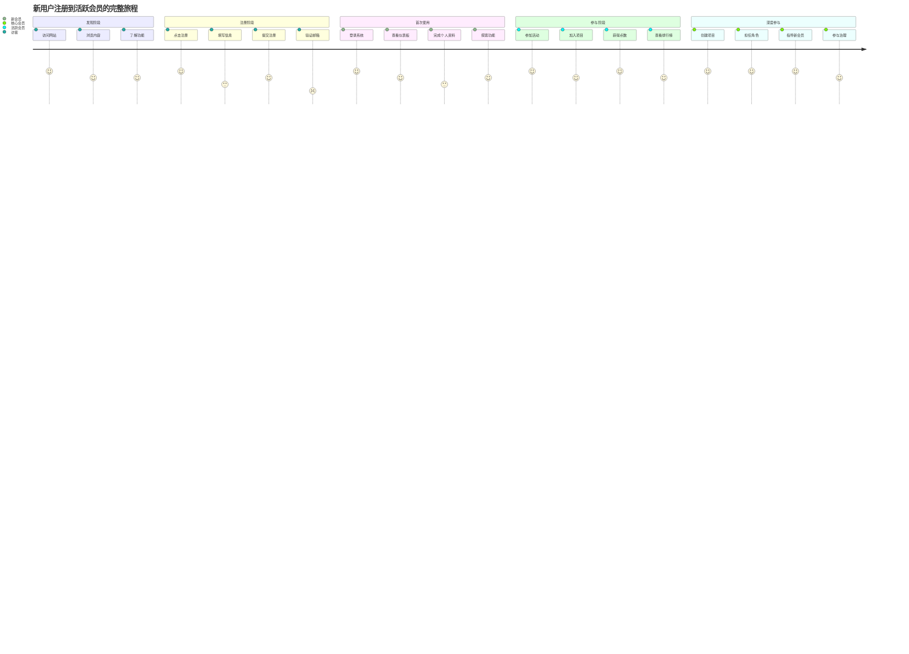
```mermaid
journey
    title 新用户注册到活跃会员的完整旅程
    section 发现阶段
      访问网站: 5: 访客
      浏览内容: 4: 访客
      了解功能: 4: 访客
    section 注册阶段
      点击注册: 5: 访客
      填写信息: 3: 访客
      提交注册: 4: 访客
      验证邮箱: 2: 访客
    section 首次使用
      登录系统: 5: 新会员
      查看仪表板: 4: 新会员
      完成个人资料: 3: 新会员
      探索功能: 4: 新会员
    section 参与阶段
      参加活动: 5: 活跃会员
      加入项目: 4: 活跃会员
      获得点数: 5: 活跃会员
      查看排行榜: 4: 活跃会员
    section 深度参与
      创建项目: 5: 核心会员
      担任角色: 5: 核心会员
      指导新会员: 5: 核心会员
      参与治理: 4: 核心会员
```

---

## 🔄 主要用户流程

### 1. 访客注册流程

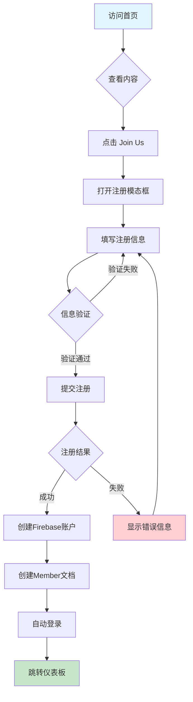
```mermaid
flowchart TD
    A[访问首页] --> B{查看内容}
    B --> C[点击 Join Us]
    C --> D[打开注册模态框]
    D --> E[填写注册信息]
    E --> F{信息验证}
    F -->|验证失败| E
    F -->|验证通过| G[提交注册]
    G --> H{注册结果}
    H -->|成功| I[创建Firebase账户]
    I --> J[创建Member文档]
    J --> K[自动登录]
    K --> L[跳转仪表板]
    H -->|失败| M[显示错误信息]
    M --> E
    
    style A fill:#e1f5ff
    style L fill:#c8e6c9
    style M fill:#ffcdd2
```

### 2. 用户登录流程

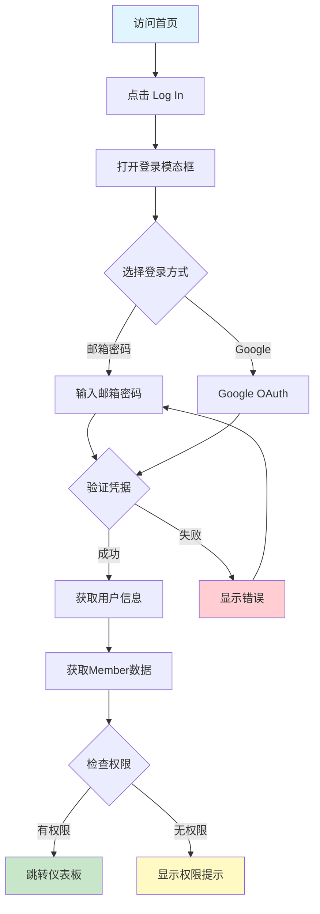
```mermaid
flowchart TD
    A[访问首页] --> B[点击 Log In]
    B --> C[打开登录模态框]
    C --> D{选择登录方式}
    D -->|邮箱密码| E[输入邮箱密码]
    D -->|Google| F[Google OAuth]
    E --> G{验证凭据}
    F --> G
    G -->|成功| H[获取用户信息]
    G -->|失败| I[显示错误]
    I --> E
    H --> J[获取Member数据]
    J --> K{检查权限}
    K -->|有权限| L[跳转仪表板]
    K -->|无权限| M[显示权限提示]
    
    style A fill:#e1f5ff
    style L fill:#c8e6c9
    style I fill:#ffcdd2
    style M fill:#fff9c4
```

### 3. 仪表板浏览流程

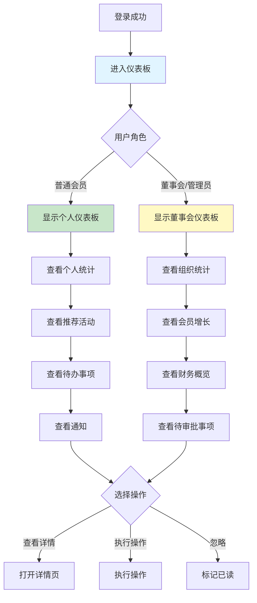
```mermaid
flowchart TD
    A[登录成功] --> B[进入仪表板]
    B --> C{用户角色}
    C -->|普通会员| D[显示个人仪表板]
    C -->|董事会/管理员| E[显示董事会仪表板]
    
    D --> F[查看个人统计]
    F --> G[查看推荐活动]
    G --> H[查看待办事项]
    H --> I[查看通知]
    
    E --> J[查看组织统计]
    J --> K[查看会员增长]
    K --> L[查看财务概览]
    L --> M[查看待审批事项]
    
    I --> N{选择操作}
    M --> N
    N -->|查看详情| O[打开详情页]
    N -->|执行操作| P[执行操作]
    N -->|忽略| Q[标记已读]
    
    style B fill:#e1f5ff
    style D fill:#c8e6c9
    style E fill:#fff9c4
```

### 4. 活动参与流程

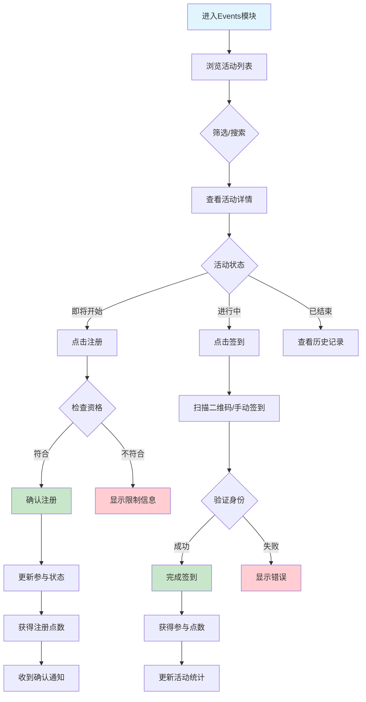
```mermaid
flowchart TD
    A[进入Events模块] --> B[浏览活动列表]
    B --> C{筛选/搜索}
    C --> D[查看活动详情]
    D --> E{活动状态}
    E -->|即将开始| F[点击注册]
    E -->|进行中| G[点击签到]
    E -->|已结束| H[查看历史记录]
    
    F --> I{检查资格}
    I -->|符合| J[确认注册]
    I -->|不符合| K[显示限制信息]
    J --> L[更新参与状态]
    L --> M[获得注册点数]
    M --> N[收到确认通知]
    
    G --> O[扫描二维码/手动签到]
    O --> P{验证身份}
    P -->|成功| Q[完成签到]
    P -->|失败| R[显示错误]
    Q --> S[获得参与点数]
    S --> T[更新活动统计]
    
    style A fill:#e1f5ff
    style J fill:#c8e6c9
    style Q fill:#c8e6c9
    style K fill:#ffcdd2
    style R fill:#ffcdd2
```

### 5. 项目管理流程

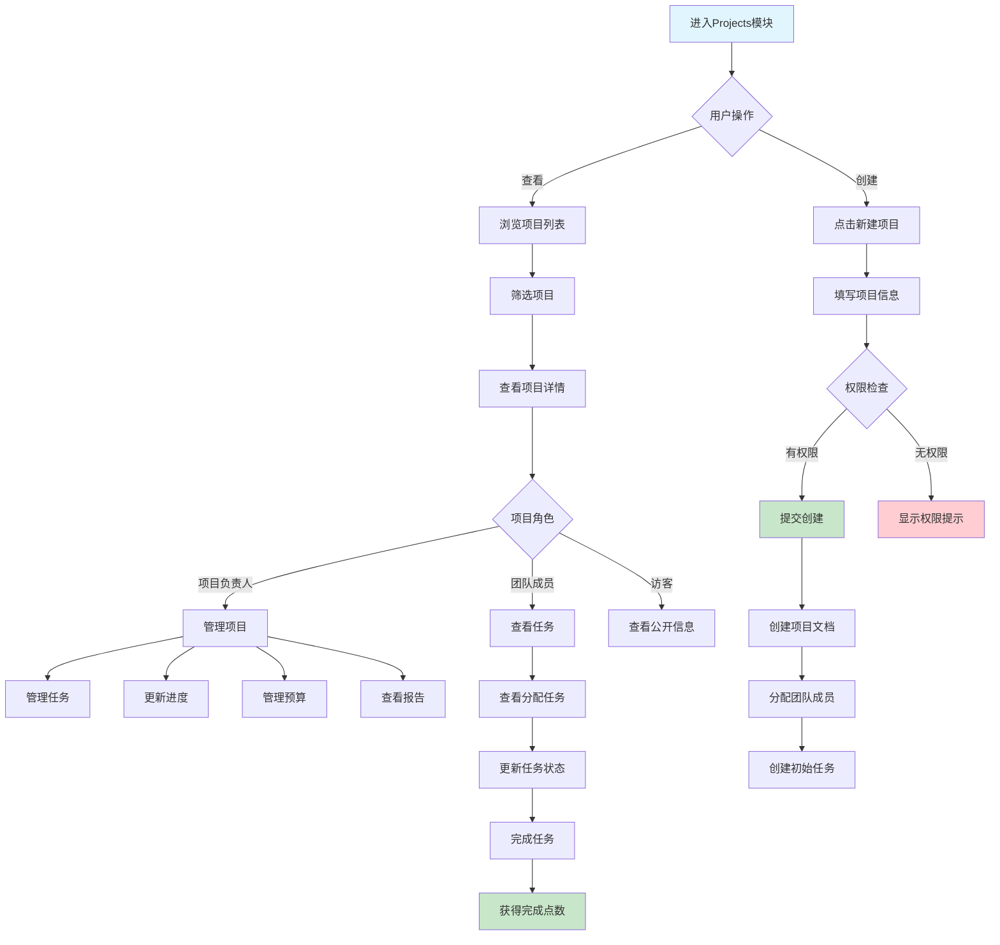
```mermaid
flowchart TD
    A[进入Projects模块] --> B{用户操作}
    B -->|查看| C[浏览项目列表]
    B -->|创建| D[点击新建项目]
    
    C --> E[筛选项目]
    E --> F[查看项目详情]
    F --> G{项目角色}
    G -->|项目负责人| H[管理项目]
    G -->|团队成员| I[查看任务]
    G -->|访客| J[查看公开信息]
    
    D --> K[填写项目信息]
    K --> L{权限检查}
    L -->|有权限| M[提交创建]
    L -->|无权限| N[显示权限提示]
    M --> O[创建项目文档]
    O --> P[分配团队成员]
    P --> Q[创建初始任务]
    
    H --> R[管理任务]
    H --> S[更新进度]
    H --> T[管理预算]
    H --> U[查看报告]
    
    I --> V[查看分配任务]
    V --> W[更新任务状态]
    W --> X[完成任务]
    X --> Y[获得完成点数]
    
    style A fill:#e1f5ff
    style M fill:#c8e6c9
    style Y fill:#c8e6c9
    style N fill:#ffcdd2
```

### 6. 会员管理流程（管理员）

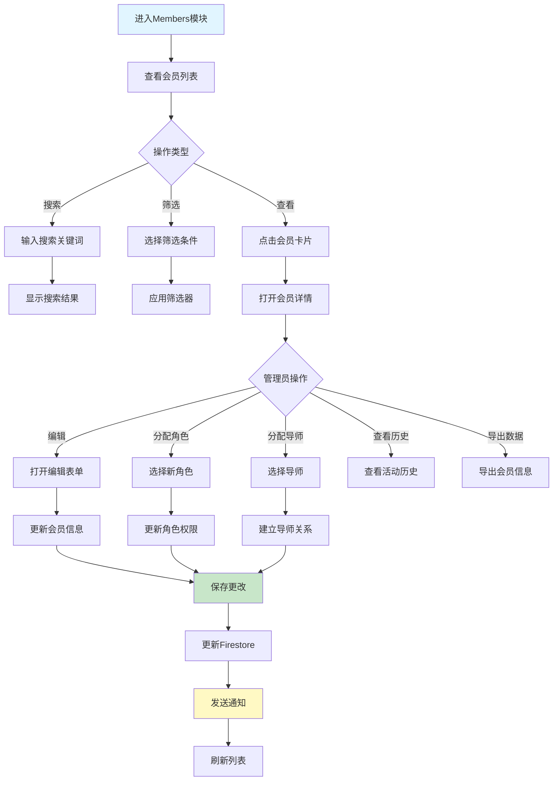
```mermaid
flowchart TD
    A[进入Members模块] --> B[查看会员列表]
    B --> C{操作类型}
    C -->|搜索| D[输入搜索关键词]
    C -->|筛选| E[选择筛选条件]
    C -->|查看| F[点击会员卡片]
    
    D --> G[显示搜索结果]
    E --> H[应用筛选器]
    F --> I[打开会员详情]
    
    I --> J{管理员操作}
    J -->|编辑| K[打开编辑表单]
    J -->|分配角色| L[选择新角色]
    J -->|分配导师| M[选择导师]
    J -->|查看历史| N[查看活动历史]
    J -->|导出数据| O[导出会员信息]
    
    K --> P[更新会员信息]
    L --> Q[更新角色权限]
    M --> R[建立导师关系]
    
    P --> S[保存更改]
    Q --> S
    R --> S
    S --> T[更新Firestore]
    T --> U[发送通知]
    U --> V[刷新列表]
    
    style A fill:#e1f5ff
    style S fill:#c8e6c9
    style U fill:#fff9c4
```

### 7. 通知处理流程

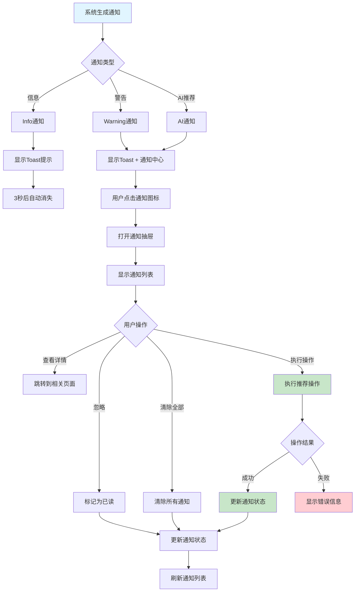
```mermaid
flowchart TD
    A[系统生成通知] --> B{通知类型}
    B -->|信息| C[Info通知]
    B -->|警告| D[Warning通知]
    B -->|AI推荐| E[AI通知]
    
    C --> F[显示Toast提示]
    D --> G[显示Toast + 通知中心]
    E --> G
    
    F --> H[3秒后自动消失]
    G --> I[用户点击通知图标]
    I --> J[打开通知抽屉]
    J --> K[显示通知列表]
    
    K --> L{用户操作}
    L -->|查看详情| M[跳转到相关页面]
    L -->|执行操作| N[执行推荐操作]
    L -->|忽略| O[标记为已读]
    L -->|清除全部| P[清除所有通知]
    
    N --> Q{操作结果}
    Q -->|成功| R[更新通知状态]
    Q -->|失败| S[显示错误信息]
    
    O --> T[更新通知状态]
    P --> T
    R --> T
    T --> U[刷新通知列表]
    
    style A fill:#e1f5ff
    style N fill:#c8e6c9
    style R fill:#c8e6c9
    style S fill:#ffcdd2
```

### 8. 游戏化系统流程

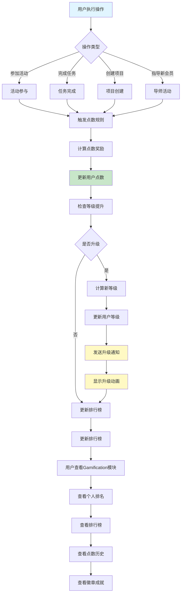
```mermaid
flowchart TD
    A[用户执行操作] --> B{操作类型}
    B -->|参加活动| C[活动参与]
    B -->|完成任务| D[任务完成]
    B -->|创建项目| E[项目创建]
    B -->|指导新会员| F[导师活动]
    
    C --> G[触发点数规则]
    D --> G
    E --> G
    F --> G
    
    G --> H[计算点数奖励]
    H --> I[更新用户点数]
    I --> J[检查等级提升]
    
    J --> K{是否升级}
    K -->|是| L[计算新等级]
    K -->|否| M[更新排行榜]
    
    L --> N[更新用户等级]
    N --> O[发送升级通知]
    O --> P[显示升级动画]
    P --> M
    
    M --> Q[更新排行榜]
    Q --> R[用户查看Gamification模块]
    R --> S[查看个人排名]
    S --> T[查看排行榜]
    T --> U[查看点数历史]
    U --> V[查看徽章成就]
    
    style A fill:#e1f5ff
    style I fill:#c8e6c9
    style O fill:#fff9c4
    style P fill:#fff9c4
```

### 9. 搜索功能流程

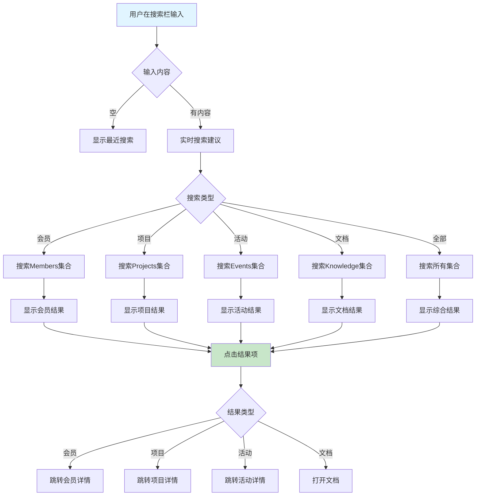
```mermaid
flowchart TD
    A[用户在搜索栏输入] --> B{输入内容}
    B -->|空| C[显示最近搜索]
    B -->|有内容| D[实时搜索建议]
    
    D --> E{搜索类型}
    E -->|会员| F[搜索Members集合]
    E -->|项目| G[搜索Projects集合]
    E -->|活动| H[搜索Events集合]
    E -->|文档| I[搜索Knowledge集合]
    E -->|全部| J[搜索所有集合]
    
    F --> K[显示会员结果]
    G --> L[显示项目结果]
    H --> M[显示活动结果]
    I --> N[显示文档结果]
    J --> O[显示综合结果]
    
    K --> P[点击结果项]
    L --> P
    M --> P
    N --> P
    O --> P
    
    P --> Q{结果类型}
    Q -->|会员| R[跳转会员详情]
    Q -->|项目| S[跳转项目详情]
    Q -->|活动| T[跳转活动详情]
    Q -->|文档| U[打开文档]
    
    style A fill:#e1f5ff
    style P fill:#c8e6c9
```

### 10. 权限控制流程

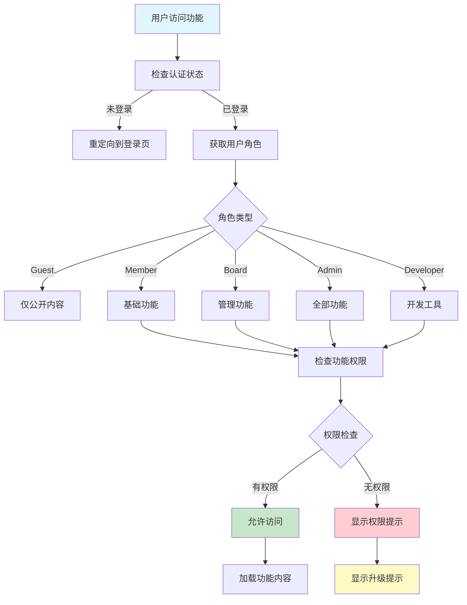
```mermaid
flowchart TD
    A[用户访问功能] --> B[检查认证状态]
    B -->|未登录| C[重定向到登录页]
    B -->|已登录| D[获取用户角色]
    
    D --> E{角色类型}
    E -->|Guest| F[仅公开内容]
    E -->|Member| G[基础功能]
    E -->|Board| H[管理功能]
    E -->|Admin| I[全部功能]
    E -->|Developer| J[开发工具]
    
    G --> K[检查功能权限]
    H --> K
    I --> K
    J --> K
    
    K --> L{权限检查}
    L -->|有权限| M[允许访问]
    L -->|无权限| N[显示权限提示]
    
    M --> O[加载功能内容]
    N --> P[显示升级提示]
    
    style A fill:#e1f5ff
    style M fill:#c8e6c9
    style N fill:#ffcdd2
    style P fill:#fff9c4
```

---

## 🎨 交互状态流程

### 按钮交互状态

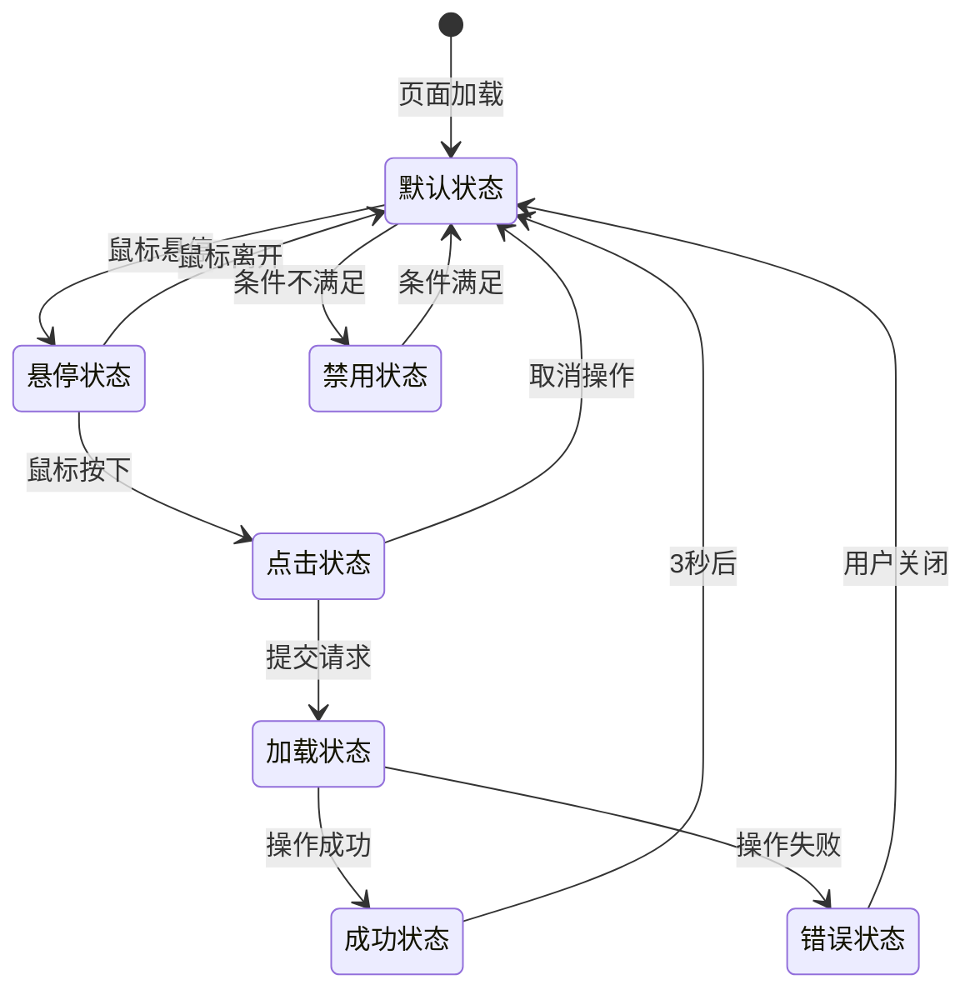
```mermaid
stateDiagram-v2
    [*] --> 默认状态: 页面加载
    默认状态 --> 悬停状态: 鼠标悬停
    悬停状态 --> 默认状态: 鼠标离开
    悬停状态 --> 点击状态: 鼠标按下
    点击状态 --> 加载状态: 提交请求
    点击状态 --> 默认状态: 取消操作
    加载状态 --> 成功状态: 操作成功
    加载状态 --> 错误状态: 操作失败
    成功状态 --> 默认状态: 3秒后
    错误状态 --> 默认状态: 用户关闭
    默认状态 --> 禁用状态: 条件不满足
    禁用状态 --> 默认状态: 条件满足
```

### 表单填写流程

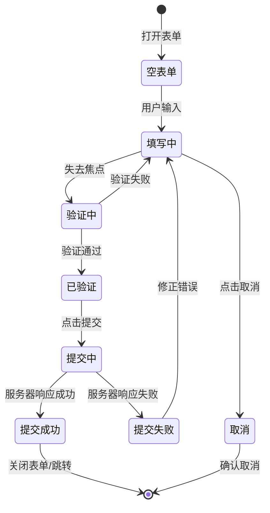
```mermaid
stateDiagram-v2
    [*] --> 空表单: 打开表单
    空表单 --> 填写中: 用户输入
    填写中 --> 验证中: 失去焦点
    验证中 --> 填写中: 验证失败
    验证中 --> 已验证: 验证通过
    已验证 --> 提交中: 点击提交
    提交中 --> 提交成功: 服务器响应成功
    提交中 --> 提交失败: 服务器响应失败
    提交成功 --> [*]: 关闭表单/跳转
    提交失败 --> 填写中: 修正错误
    填写中 --> 取消: 点击取消
    取消 --> [*]: 确认取消
```

---

## 📱 响应式交互流程

### 移动端导航流程

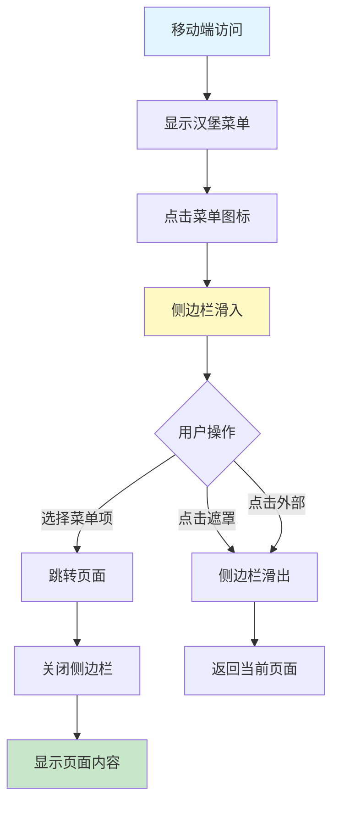
```mermaid
flowchart TD
    A[移动端访问] --> B[显示汉堡菜单]
    B --> C[点击菜单图标]
    C --> D[侧边栏滑入]
    D --> E{用户操作}
    E -->|选择菜单项| F[跳转页面]
    E -->|点击遮罩| G[侧边栏滑出]
    E -->|点击外部| G
    
    F --> H[关闭侧边栏]
    H --> I[显示页面内容]
    
    G --> J[返回当前页面]
    
    style A fill:#e1f5ff
    style D fill:#fff9c4
    style I fill:#c8e6c9
```

---

## 🔔 通知交互流程

### 通知生命周期

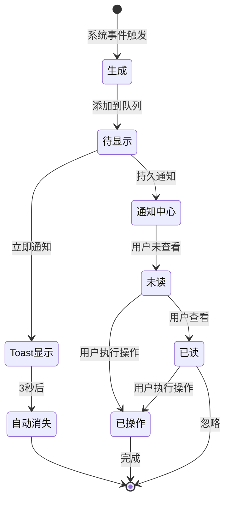
```mermaid
stateDiagram-v2
    [*] --> 生成: 系统事件触发
    生成 --> 待显示: 添加到队列
    待显示 --> Toast显示: 立即通知
    待显示 --> 通知中心: 持久通知
    Toast显示 --> 自动消失: 3秒后
    自动消失 --> [*]
    通知中心 --> 未读: 用户未查看
    未读 --> 已读: 用户查看
    未读 --> 已操作: 用户执行操作
    已读 --> 已操作: 用户执行操作
    已操作 --> [*]: 完成
    已读 --> [*]: 忽略
```

---

## 🎯 用户目标完成流程

### 完成一个完整任务的目标流程

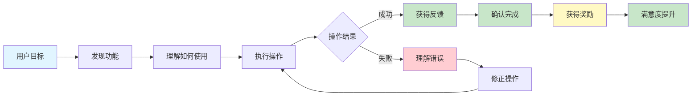
```mermaid
flowchart LR
    A[用户目标] --> B[发现功能]
    B --> C[理解如何使用]
    C --> D[执行操作]
    D --> E{操作结果}
    E -->|成功| F[获得反馈]
    E -->|失败| G[理解错误]
    G --> H[修正操作]
    H --> D
    F --> I[确认完成]
    I --> J[获得奖励]
    J --> K[满意度提升]
    
    style A fill:#e1f5ff
    style F fill:#c8e6c9
    style I fill:#c8e6c9
    style J fill:#fff9c4
    style K fill:#c8e6c9
    style G fill:#ffcdd2
```

---

## 📊 数据可视化交互流程

### 图表交互流程

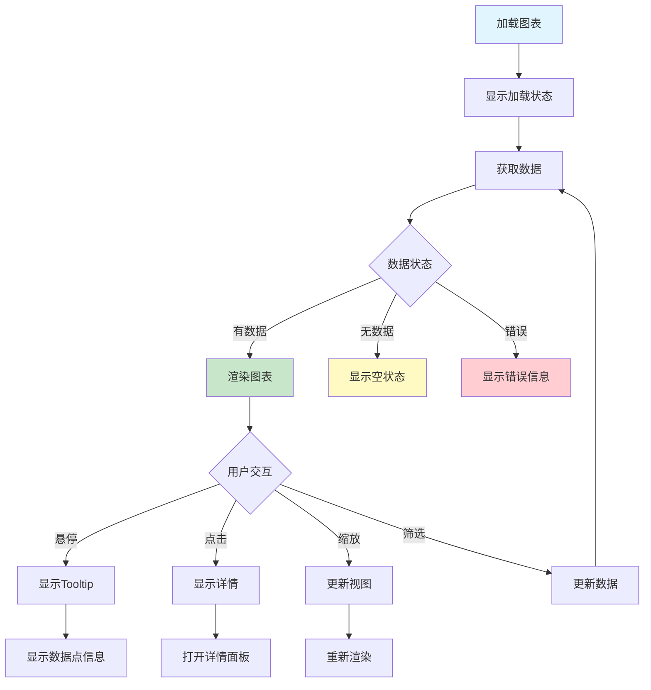
```mermaid
flowchart TD
    A[加载图表] --> B[显示加载状态]
    B --> C[获取数据]
    C --> D{数据状态}
    D -->|有数据| E[渲染图表]
    D -->|无数据| F[显示空状态]
    D -->|错误| G[显示错误信息]
    
    E --> H{用户交互}
    H -->|悬停| I[显示Tooltip]
    H -->|点击| J[显示详情]
    H -->|缩放| K[更新视图]
    H -->|筛选| L[更新数据]
    
    I --> M[显示数据点信息]
    J --> N[打开详情面板]
    K --> O[重新渲染]
    L --> C
    
    style A fill:#e1f5ff
    style E fill:#c8e6c9
    style F fill:#fff9c4
    style G fill:#ffcdd2
```

---

## 🎓 学习曲线流程

### 新用户学习使用系统的流程

```mermaid
gantt
    title 新用户学习曲线
    dateFormat X
    axisFormat %s
    
    section 第1周
    熟悉界面           :0, 2d
    完成个人资料       :2, 1d
    参加第一个活动     :3, 2d
    查看仪表板         :5, 2d
    
    section 第2周
    加入项目           :7, 2d
    完成任务           :9, 2d
    查看排行榜         :11, 2d
    使用搜索功能       :13, 2d
    
    section 第3-4周
    创建项目           :15, 3d
    管理任务           :18, 3d
    参与治理           :21, 3d
    成为活跃用户       :24, 4d
```

---

## 🔄 错误处理流程

### 错误恢复流程

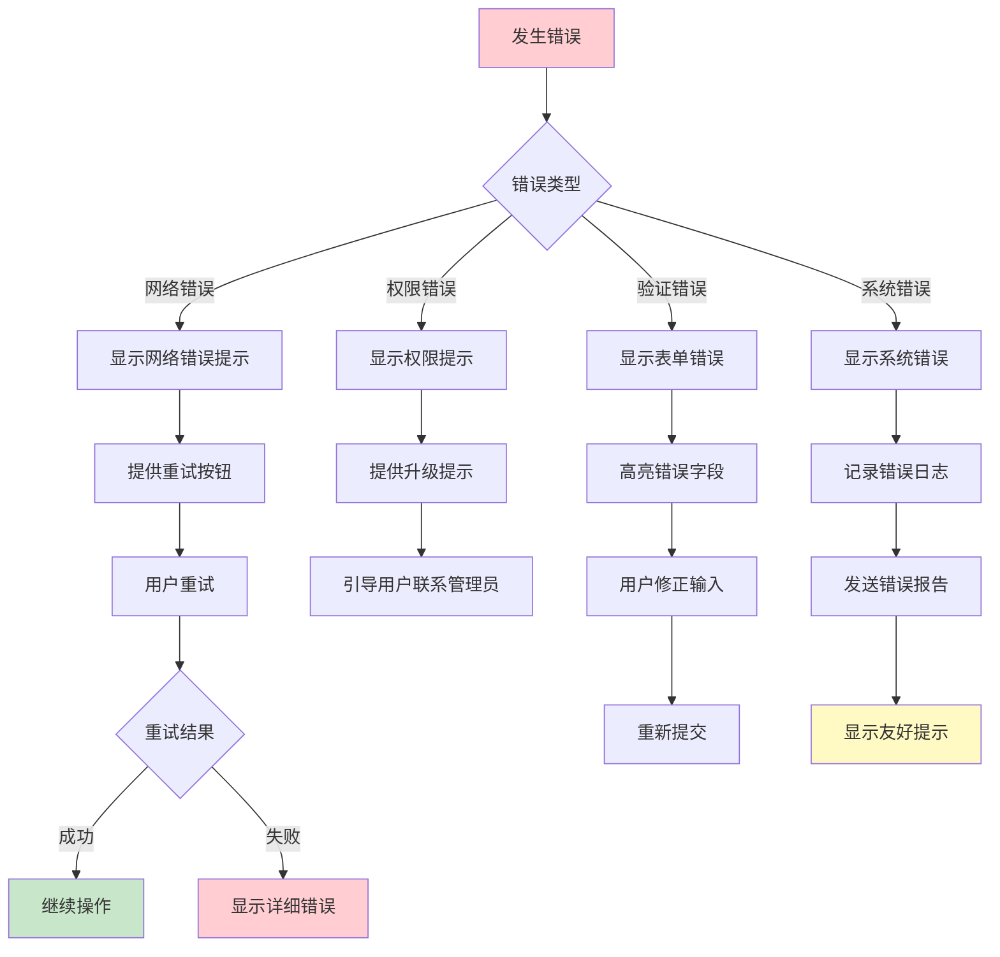
```mermaid
flowchart TD
    A[发生错误] --> B{错误类型}
    B -->|网络错误| C[显示网络错误提示]
    B -->|权限错误| D[显示权限提示]
    B -->|验证错误| E[显示表单错误]
    B -->|系统错误| F[显示系统错误]
    
    C --> G[提供重试按钮]
    D --> H[提供升级提示]
    E --> I[高亮错误字段]
    F --> J[记录错误日志]
    
    G --> K[用户重试]
    K --> L{重试结果}
    L -->|成功| M[继续操作]
    L -->|失败| N[显示详细错误]
    
    H --> O[引导用户联系管理员]
    I --> P[用户修正输入]
    P --> Q[重新提交]
    
    J --> R[发送错误报告]
    R --> S[显示友好提示]
    
    style A fill:#ffcdd2
    style M fill:#c8e6c9
    style N fill:#ffcdd2
    style S fill:#fff9c4
```

---

## 📝 使用说明

这些 Mermaid 图表可以在以下环境中查看和编辑：

1. **GitHub/GitLab**: 直接在 Markdown 文件中渲染
2. **VS Code**: 安装 "Markdown Preview Mermaid Support" 扩展
3. **在线编辑器**: [Mermaid Live Editor](https://mermaid.live/)
4. **文档工具**: Notion, Obsidian 等支持 Mermaid 的工具

---

**文档版本**: 1.0.0  
**最后更新**: 2024年  
**维护者**: JCI Kuala Lumpur 开发团队

