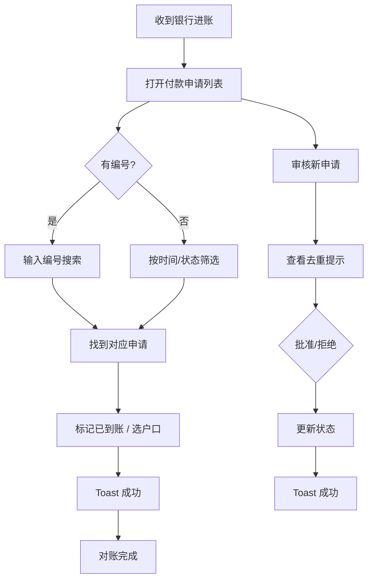
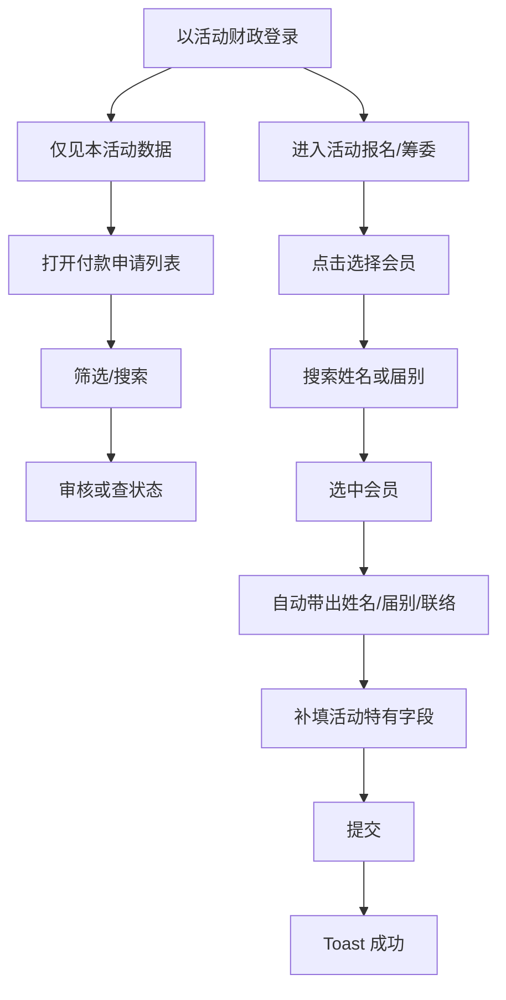
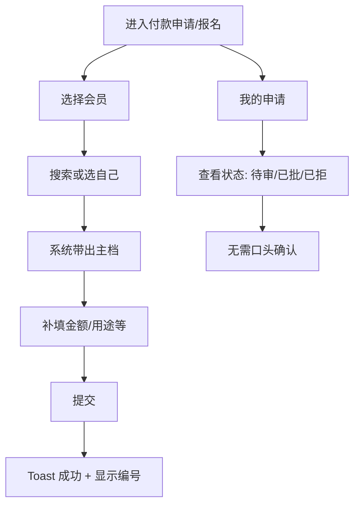

# UX Design Specification - JCI LO 管理应用

**Author:** User
**Date:** 2025-02-16

---

## Executive Summary

### Project Vision

JCI LO 管理应用以「效率提升」为核心，在义务服务、人力有限的前提下，通过会员主档单一来源、财务对账与工作流平台化、活动与参与一体化，减少管理员与会员的重复录入与人工对账。**根因**：历史上缺乏「会员主档 + 编号体系 + 工作流平台化」的一体化系统，导致重复填写、对账难、状态不同步。产品为棕地增强，在现有会员/财务/活动模块上做联动与强化，不新增独立业务模块。MVP 策略为先在一两个场景或活动内跑通并验收，形成可复制范例后再推广。

### Target Users

- **组织财政长（陈姐）**：对账与分类省时、付款申请统一列表与去重提示、多户口与错户处理；成功时刻：「不用再到处问这笔款对应哪笔申请」。主要设备：桌面/平板。
- **活动财政 / 筹委（阿明）**：仅看本活动财务、报名—缴费—签到一致、选会员即带出；成功时刻：「活动财务一目了然」「带出会员就带出资料」。主要设备：桌面/平板。
- **会员（小琳）**：一处填写多处带出、状态与参与记录可查；成功时刻：「不用再重复填表」「能查到自己的记录」。主要设备：可能更多使用手机。
- **管理员 / 组织秘书（李秘书）**：宣导新流程、主档维护、换届交接；成功时刻：「宣导与责任清晰了，换人也能接得上」。

**UX 情感目标**：围绕「不用到处问」「活动财务一目了然」「不用再重复填表」等成功时刻展开设计。

### Key Design Challenges

1. **多角色信息架构与权限边界**：组织财政、活动财政、会员、管理员需不同视图与可见范围，避免信息混淆与越权。
2. **主档带出的无缝融入**：选会员即带出需在付款申请、活动报名、筹委名单等场景自然融入，不打断流程。
3. **义务服务下的低学习成本**：换届频繁，需首次使用引导与简洁说明，降低交接成本。
4. **对账与工作流的高效操作**：列表、筛选、去重、编号搜索需在 3–5 秒内可感知完成。
5. **角色驱动的数据可见性与 Firestore 规则一致性**：活动财政仅见本活动数据，UI 须从根上按角色划分，与安全规则一致。
6. **近实时状态的 UI 反馈**：付款申请状态、名单与缴费状态依赖 Firestore 监听，需处理加载态、增量更新、乐观更新与错误回退。
7. **MVP 的可演示性与可复制性**：首次使用路径要短，示范路径清晰，便于理事会判断是否推广。

### Design Opportunities

1. **渐进式引导与带出**：在付款申请、主档带出、编号对账等关键流程中提供首次使用引导，提高采纳率。
2. **角色驱动的导航与仪表盘**：按角色展示任务与入口，减少无关信息干扰。
3. **状态可见与反馈**：申请状态、对账进度、会费状态清晰可见，减少口头确认需求。
4. **可交接的设计语言**：文案、图标、流程说明统一、可导出、可交接，降低换届后使用成本。
5. **成功指标的可视化**：主档带出场景数、付款申请状态可查、编号勾稽等在 UI 上可直观验证与呈现。

---

## Core User Experience

### Defining Experience

**核心用户动作**：选会员即带出、付款申请全流程、按编号勾稽对账。用户最常做的三件事：(1) 财政：查看/处理付款申请与对账；(2) 筹委：在活动中选会员带出资料；(3) 会员：查看状态或报名/申请。产品价值体现在「选即得」「状态透明」「对账可追溯」。

**核心循环**：财政—提交申请→审核→对账；筹委/会员—选会员→带出→提交；会员—查状态→确认。若这三类流程顺畅，整体体验即可建立。

### Platform Strategy

- **形态**：Web 应用（React SPA + Firebase），沿用现有架构。
- **设备优先级**：桌面与平板优先（财政、筹委）；手机以「可用」为基线（会员查状态、报名）。
- **交互方式**：以鼠标/键盘为主，触屏为辅；关键流程需支持键盘操作（NFR-A1）。
- **实时性**：Firestore 监听用于付款申请状态、名单与缴费状态，需支持近实时更新。
- **离线**：当前不要求离线能力；内部工具以在线使用为主。

### Effortless Interactions

1. **选会员即带出**：在付款申请、活动报名、筹委名单中选会员后，姓名、届别、联络方式等自动填充，无需重复输入。
2. **按编号搜索**：输入或选择参考编号即可快速定位对应申请或流水，对账时间显著缩短。
3. **状态自动刷新**：申请审批、缴费到账等状态变更后，列表与详情自动更新，无需手动刷新。
4. **去重提示**：同一活动+同一金额+同一申请人+时间窗的重复申请在列表中突出提示，审核更高效。
5. **角色即视图**：按角色展示入口与数据范围，减少无关信息干扰。

### Critical Success Moments

| 角色 | 成功时刻 | 对应交互 |
|------|----------|----------|
| 陈姐（组织财政） | 搜编号即找到对应申请，对账完成 | 编号搜索 + 勾稽标记 |
| 阿明（活动财政） | 选会员即带出，活动财务一目了然 | 会员选择器 + 活动维度过滤 |
| 小琳（会员） | 选自己即带出，不用再重复填表 | 会员身份选择 + 主档带出 |
| 李秘书（管理员） | 新人按文档即可上手 | 首次引导 + 统一帮助入口 |

**若失败的环节**：主档带出失败、编号搜索无结果、状态不同步——会直接破坏信任与采纳率。

### Experience Principles

1. **选即得**：选会员或编号即自动带出或定位，尽量减少手动输入与二次确认。
2. **状态透明**：申请、对账、会费状态实时可见，减少口头确认与追问。
3. **角色即视图**：按角色划分入口与数据范围，信息架构与权限一致。
4. **一次学会、可交接**：引导与文案统一、可导出、可交接，降低换届后的学习与使用成本。
5. **可演示**：关键流程支持清晰、可复制的示范路径，便于理事会判断推广价值。

---

## Desired Emotional Response

### Primary Emotional Goals

1. **省心与解脱**：财政与筹委完成对账、审核、带出后，感到「不再到处问人」「不用再对 Excel 和银行流水」。
2. **掌控与清晰**：组织财政长感到对账与付款申请可追溯、可掌控；活动财政感到本活动财务一目了然。
3. **被记住与省事**：会员感到系统「记得我」，不用重复填表，少做无意义劳动。
4. **可持续与放心**：管理员/秘书感到流程可交接、换届可延续，不必担心退回到旧做法。

### Emotional Journey Mapping

| 阶段 | 期望感受 | 设计目标 |
|------|----------|----------|
| 首次接触 | 不慌张、有引导 | 首次使用引导清晰，帮助入口易找 |
| 核心操作中 | 顺畅、少卡顿 | 选即得、状态实时更新、反馈明确 |
| 完成任务后 | 省时、有成就感 | 成功反馈、可量化结果（如对账笔数） |
| 出错时 | 不迷茫、可恢复 | 明确错误提示、可重试或修正 |
| 再次使用 | 熟悉、可预测 | 流程一致、文案统一、可交接 |

### Micro-Emotions

- **信任 vs 怀疑**：状态可查、编号可追溯，建立「系统可靠」的信任。
- **自信 vs 焦虑**：对账与审核有清晰依据，减少「是否漏对、是否审错」的焦虑。
- **轻松 vs 挫败**：选会员即带出、按编号即定位，减少重复劳动带来的挫败感。
- **归属 vs 疏离**：会员感到被组织「记得」，参与与筹委经历被记录，增强归属感。

### Design Implications

| 情感目标 | UX 设计手段 |
|----------|-------------|
| 省心 | 去重提示、编号搜索、状态自动刷新，减少人工核对 |
| 掌控 | 按角色划分视图、权限边界清晰、审计与可追溯 |
| 被记住 | 选会员即带出、主档单一来源、个人状态可查 |
| 可持续 | 统一帮助入口、可导出说明、首次引导可复用 |
| 信任 | 明确成功/失败反馈、状态实时可见、不依赖颜色单独传达信息（NFR-A2） |

### Emotional Design Principles

1. **少问一句是一句**：设计以减少口头确认、群组追问为目标。
2. **状态即安心**：申请、对账、会费状态清晰可见，减少猜测和焦虑。
3. **选即得即省心**：选会员或编号后自动带出或定位，减少输入与重复劳动。
4. **可交接即可持续**：文案、引导、说明统一且可导出，换届后仍能沿用。
5. **反馈即信任**：操作后给予明确成功/失败反馈，避免无声失败或模棱两可的状态。

---

## UX Pattern Analysis & Inspiration

### Inspiring Products Analysis

| 参考类型 | 代表产品 / 形态 | 可借鉴点 | 与本项目的关联 |
|----------|-----------------|----------|----------------|
| **表格与清单** | Airtable / Notion | 列筛选、搜索、分页、状态标签、批量操作 | 付款申请列表、对账视图、会员选择 |
| **财务 / 后台** | Stripe Dashboard / 银行网银 | 交易列表、状态筛选、编号搜索、导出 | 付款申请、流水勾稽、编号定位 |
| **工作流** | Trello / Linear | 看板/列表视图、状态流转、卡片摘要、去重与关联 | 付款申请审核、状态可查 |
| **会员选择器** | CRM / 活动报名 | 搜索即选、自动补全、选中即带出 | 选会员即带出 |
| **引导与帮助** | Intercom / 产品内帮助 | 首次引导条、帮助入口、可导出文档 | 新流程说明、换届交接 |

**共同点**：清单可筛选、状态清晰、搜索快速、操作有反馈；信息分层，避免一次加载过多内容。

### Transferable UX Patterns

**导航与信息架构**
- **角色入口**：按角色（组织财政/活动财政/会员/管理员）提供差异化首页与导航，减少无关入口。
- **层级筛选**：先选活动/日期范围，再展示列表，支持「活动财政仅见本活动」的天然过滤。

**交互模式**
- **搜索即定位**：编号/关键词搜索后直接跳转对应记录，支持对账「搜编号→立刻找到」。
- **选中即带出**：会员选择器选中后自动填充表单字段，减少手动输入。
- **状态标签**：待审/已批/已拒等用标签展示，支持筛选与快速识别。
- **去重/相似提示**：列表行或筛选区显示「可能存在重复」的提示，不打断主流程。

**视觉与反馈**
- **成功/失败 Toast**：操作后明确反馈，不依赖颜色单独传达。
- **加载态与骨架屏**：列表加载时显示骨架，避免空白或长时间转圈。
- **空状态说明**：无数据时说明原因与下一步操作，而非纯空列表。

### Anti-Patterns to Avoid

| 反模式 | 问题 | 本项目的应对 |
|--------|------|--------------|
| 全量加载无分页 | 大量数据一次渲染，首屏慢、易卡顿 | 分页或懒加载，符合 NFR-P1 |
| 状态仅用颜色 | 色盲或对比度不足时无法识别 | 状态配文字/图标（NFR-A2） |
| 无搜索仅靠滚动 | 对账时无法快速按编号定位 | 编号搜索为必备能力 |
| 多入口重复表单 | 会员资料多处填写、风格不一 | 主档带出、表单统一 |
| 引导一次性不可复用 | 换届后新人无据可依 | 可导出、可交接的说明与引导 |
| 跨角色混排数据 | 活动财政看到其他活动数据 | 从权限与查询层面限制，UI 不展示 |
| 静默失败 | 提交失败无提示或提示含糊 | 明确错误信息与可重试路径 |

### Design Inspiration Strategy

**采纳**
- 清单式布局 + 筛选 + 编号搜索，支撑对账与付款申请列表。
- 会员选择器（搜索即选 + 选中即带出），支撑主档带出场景。
- 状态标签 + 筛选，支撑审核与状态可查。
- Toast + 明确文案，支撑「反馈即信任」。

**改造**
- 不追求看板视图：当前以列表为主，看板可作后续扩展。
- 简化筛选：优先编号/状态/活动，避免过多组合筛选增加负担。
- 引导与帮助：与义务服务、换届场景结合，强调可交接与可复用。

**避免**
- 全量加载、无分页的列表。
- 仅用颜色表示状态。
- 跨角色数据混排或权限边界模糊的 UI。
- 无法导出或复用的引导与说明。

---

## Design System Foundation

### 1.1 Design System Choice

**Tailwind CSS + 自定义组件库（延续现有实现）**

项目为棕地增强，沿用现有 `tailwindcss` + `components/ui/Common.tsx` 体系，不引入新的完整 UI 框架（如 MUI、Ant Design、Chakra）。组件基于 Tailwind 工具类构建，具备 Button、Card、Badge、Tabs、Drawer、Toast、表单控件等基础能力。

### Rationale for Selection

- **棕地一致性**：PRD 明确「沿用现有 Tailwind 与组件体系」，新功能与现有视觉与交互保持一致。
- **开发效率**：无需学习新框架，团队已熟悉 Tailwind 与现有组件。
- **可定制性**：Tailwind 配置与组件可随品牌与 NFR 调整（如 WCAG 2.1 AA 对比度、间距、字号）。
- **体积与性能**：无大型 UI 库依赖，按需使用 Tailwind 与组件，利于首屏与列表性能（NFR-P1）。

### Implementation Approach

1. **扩展现有组件**：在 `Common.tsx` 或新建模块中增加会员选择器、状态标签、编号搜索输入、去重提示等，与现有 Button、Card、Badge 等风格统一。
2. **Tailwind 设计令牌**：在 `tailwind.config.js` 中定义色彩、间距、圆角、阴影等 token，便于主题与无障碍调整。
3. **新增模块的组件使用**：付款申请、对账、主档带出等新页面优先使用现有组件，不足时再扩展，保持设计语言一致。

### Customization Strategy

- **色彩与对比度**：确保状态标签（待审/已批/已拒）等满足 NFR-A1，不单靠颜色传达信息。
- **间距与密度**：财政/筹委以桌面为主，可适当提高信息密度；会员端兼顾手机，保证触摸目标与可读性。
- **反馈与 Toast**：延续现有 Toast 机制，用于成功/失败反馈，支持「反馈即信任」的情感目标。

---

## Defining Core Interaction

### 2.1 Defining Experience

**核心交互**：「选会员即带出」——在付款申请、活动报名、筹委名单等场景中，用户通过搜索或选择会员身份，系统从主档自动带出姓名、届别、联络方式等约定字段，无需手动输入。

**一句话描述**：用户向朋友介绍时会说——「选一下会员，资料就自动填好了，不用再到处复制粘贴」。

**若做好这一件事**：主档单一来源的价值会自然延伸到对账（申请人可追溯）、状态可查（与主档联动）、换届交接（主档维护责任清晰）等环节。

### 2.2 User Mental Model

- **用户当前做法**：在 Excel/表格中复制粘贴，或每次手动填写姓名、届别、电话等。
- **用户心智**：「系统应该记得我是谁」「选人就应该带出资料」。
- **易困惑点**：未选会员时是否还能提交、带出字段能否修改、主档与当前表单的关系。
- **期望**：选即得，带出字段可覆盖（如有特殊需求），未选会员时仍可提交（视产品策略而定）。

### 2.3 Success Criteria

1. **选即得**：选中会员后，约定字段在 1 秒内自动填充。
2. **可追溯**：带出数据来自主档，与主档一致，审计可查。
3. **反馈明确**：带出成功时有视觉反馈（如字段高亮或图标），带出失败时有明确提示。
4. **跨场景一致**：付款申请与活动报名等场景的带出字段与交互一致，降低学习成本。

### 2.4 Novel UX Patterns

- **模式**：以成熟模式为主——搜索/选择 + 自动填充，类似 CRM 与活动报名产品。
- **差异化**：在义务组织、多角色、主档单一来源的约束下，强调「选即得」与「可交接」。
- **创新点**：统一带出字段列表（config/常量）、跨场景一致交互、与权限/loId 绑定的会员选择范围。

### 2.5 Experience Mechanics

| 阶段 | 用户动作 | 系统响应 | 反馈 |
|------|----------|----------|------|
| **触发** | 进入付款申请/活动报名表单，看到「选择会员」控件 | 展示会员选择器（搜索或下拉） | 占位提示或引导 |
| **选择** | 输入关键词或选择会员 | 按权限过滤（如 loId），展示匹配列表 | 列表加载态 |
| **带出** | 选中会员 | 查询主档，填充约定字段 | 字段填充 + 可选成功态 |
| **完成** | 确认或修改后提交 | 校验并写入，关联 applicantId / 主档引用 | Toast 成功/失败 |
| **异常** | 主档缺失或查询失败 | 显示错误提示，允许重选或手动填写 | 明确错误信息，可重试 |

---

## Visual Design Foundation

### Color System

**品牌色（沿用 tailwind.config.js）**
- `jci.blue` #0097D7 — 主色、链接、CTA
- `jci.lightblue` #6EC4E8 — 辅助、悬停
- `jci.navy` #1C3F94 — 深色、标题
- `jci.teal` #00B5B5 — 强调、成功

**语义色**
- 主色（primary）：jci.blue
- 成功（success）：jci.teal 或 green-600
- 警告（warning）：amber-600
- 错误（error）：red-600
- 信息（info）：jci.blue

**状态标签（待审/已批/已拒）**：除颜色外须配合文字或图标，符合 NFR-A2。

**对比度**：正文与背景对比度 ≥ 4.5:1，大字 ≥ 3:1（WCAG 2.1 AA）。

### Typography System

**基调**：专业、清晰，适合财政与后台场景。

**字体系列**：沿用系统或 Tailwind 默认（如 sans-serif），必要时可引入品牌字体。

**字号层级**
- H1: text-2xl / text-3xl
- H2: text-xl
- H3: text-lg
- Body: text-base
- Small: text-sm
- Caption: text-xs

**行高**：正文 leading-relaxed，标题 leading-tight。

### Spacing & Layout Foundation

**间距基准**：4px（Tailwind 默认），常用 2、4、6、8 单位。

**布局**：财政/筹委以桌面为主，信息密度适中；会员端兼顾手机，留足触控空间（约 44px）。

**栅格**：沿用 Tailwind 的响应式 grid/flex；关键页面使用容器 max-w 控制阅读宽度。

### Accessibility Considerations

- **对比度**：主色与背景满足 WCAG AA，必要时用 navy 替代 blue 增强对比。
- **焦点**：可聚焦元素有 visible focus 样式，支持键盘操作（NFR-A1）。
- **状态**：成功/失败/警告不仅依赖颜色，须配合文字或图标（NFR-A2）。
- **标签**：表单控件有明确 label，错误提示与控件关联。

---

## Design Direction Decision

### Design Directions Explored

- **方向 A：付款申请列表** — 清单式布局、编号搜索、状态筛选、状态标签（文字+颜色），支持组织财政与活动财政视图。
- **方向 B：选会员即带出** — 会员选择器（搜索即选）→ 选中后自动填充姓名、届别、联络方式；带出成功有视觉反馈。
- **方向 C：角色驱动导航** — 按组织财政、活动财政、会员等角色展示入口与任务，减少无关信息干扰。

### Chosen Direction

**延续现有视觉 + 按 UX 规格增强**：沿用 Tailwind + JCI 品牌色 + Common 组件体系，在新功能（付款申请、主档带出、对账）中应用上述方向 A、B、C 的交互与布局模式。

### Design Rationale

- 棕地项目，需与现有界面保持视觉与交互一致。
- 规格中的核心交互（选即得、状态透明、角色即视图）通过上述模式落实。
- 不引入新设计语言，降低实施与交接成本。

### Implementation Approach

1. 付款申请列表：使用 Card + 表格/列表组件，增加编号搜索、状态筛选、状态 Badge。
2. 主档带出：新增会员选择器组件（搜索 + 选中即填充），与 Form 集成。
3. 导航：按角色展示侧栏或首页入口，与现有路由与权限逻辑衔接。

---

## User Journey Flows

### Journey 1：陈姐（组织财政）— 对账与付款申请

**目标**：收到银行进账后，按编号找到对应申请并勾稽；审核付款申请列表。

**关键节点**：编号搜索 → 快速定位；去重提示 → 审核省时；Toast → 明确反馈。

### Journey 2：阿明（活动财政）— 活动财务与主档带出

**目标**：查看本活动付款申请；在报名/筹委名单中选会员即带出。

**关键节点**：活动过滤（权限）→ 仅见本活动；选会员即带出 → 减少重复填写。

### Journey 3：小琳（会员）— 选自己即带出、查状态

**目标**：在付款申请或活动报名中选自己，自动带出主档；查询申请状态。

**关键节点**：选自己即带出 → 不用重复填表；自助查状态 → 减少追问。

### Journey Patterns

- **入口**：按角色进入对应列表或表单（组织财政→全组织；活动财政→本活动；会员→我的）。
- **搜索即定位**：编号搜索、会员搜索，减少滚动与筛选步骤。
- **选即得**：选中会员后自动填充，减少输入。
- **反馈**：关键操作后 Toast 成功/失败，状态变更后列表自动刷新。

### Flow Optimization Principles

1. **最短路径**：编号搜索一步到位；选会员即带出，无需二次确认。
2. **渐进披露**：列表先展示摘要，详情按需展开；表单分步时每步有明确进度。
3. **错误可恢复**：带出失败可重选或手动填写；提交失败有明确提示与重试。
4. **状态透明**：列表与详情状态一致，支持近实时更新。

---

## Component Strategy

### Design System Components

**已有组件（Common.tsx）**
- Button、Card、Badge、Tabs、Drawer、Toast
- 表单控件（Input、Select 等，来自 Form.tsx）

**覆盖情况**
- 列表容器：Card 可复用
- 状态展示：Badge 已有 success/warning/error/info/jci 等 variant，可扩展「待审/已批/已拒」
- 反馈：Toast 已支持 success/error/info/warning
- 布局：Tabs、Drawer 可复用

### Custom Components

#### 1. MemberSelector（会员选择器）

**用途**：在付款申请、活动报名、筹委名单等场景中选择会员并自动带出主档字段。

**结构**：搜索输入 + 下拉列表 + 选中结果展示；带出字段区（只读或可覆盖）。

**状态**：空、加载中、有结果、选中、带出成功、带出失败、错误。

**无障碍**：label、aria-expanded、aria-activedescendant、键盘导航（上下选、Enter 确认）。

**内容约定**：带出字段由 config/常量统一维护（如 name, cohort, contact）。

#### 2. PaymentRequestList（付款申请列表）

**用途**：展示付款申请列表，支持编号搜索、状态筛选、去重提示、分页/懒加载。

**结构**：搜索栏 + 筛选器 + 表格/列表 + 分页；行内可含状态 Badge、操作按钮。

**状态**：加载中、空、有数据、去重提示（行或筛选区）。

**无障碍**：表头、行可聚焦、操作可键盘触发。

#### 3. ReferenceNumberSearch（编号搜索输入）

**用途**：对账场景下按参考编号快速定位申请或流水。

**结构**：带占位提示的输入框，支持回车搜索；可选下拉历史/建议。

**状态**：空、输入中、搜索中、有结果、无结果。

#### 4. DuplicateHint（去重提示）

**用途**：对符合「同一活动+同一金额+同一申请人+时间窗」的重复申请给出提示。

**结构**：行内或筛选区的小提示条，可折叠；不阻断主流程。

### Component Implementation Strategy

1. **基于现有组件**：MemberSelector 内部使用 Input；PaymentRequestList 使用 Card + 表格；StatusBadge 使用 Badge 的 semantic variant。
2. **设计令牌**：色彩、间距沿用 Tailwind + JCI 配置，状态色满足 NFR-A2。
3. **无障碍**：所有自定义组件遵循 NFR-A1，支持键盘与焦点管理。

### Implementation Roadmap

| 阶段 | 组件 | 支持旅程 | 优先级 |
|------|------|----------|--------|
| Phase 1 | MemberSelector | 阿明、小琳（主档带出） | P0 |
| Phase 1 | PaymentRequestList + StatusBadge | 陈姐、阿明（列表与审核） | P0 |
| Phase 1 | ReferenceNumberSearch | 陈姐（对账） | P0 |
| Phase 2 | DuplicateHint | 陈姐（去重提示） | P1 |
| Phase 2 | 首次引导条/Modal | 李秘书（新流程说明） | P1 |

---

## UX Consistency Patterns

### Button Hierarchy

- **主操作（Primary）**：每个区块/表单一个主按钮，如「提交」「批准」「保存」，使用 jci.blue。
- **次操作（Secondary）**：取消、返回、次要操作使用 outline 或 ghost 变体。
- **危险操作（Danger）**：拒绝、删除等使用 danger 变体，必要时配合确认。
- **层级**：主 > 次 > ghost；避免同一区块内多个主按钮。

### Feedback Patterns

- **成功**：Toast 右上/右下，绿色系，3 秒后消失；关键操作可加简短确认文案（如「已保存」）。
- **失败**：Toast + 明确错误说明，可含重试或修正指引；不依赖颜色单独传达（NFR-A2）。
- **加载**：列表用骨架屏或 spinner；表单提交时按钮 loading 态，禁用重复提交。
- **状态变更**：列表/详情支持近实时更新；可选用 subtle 高亮提示变更行。

### Form Patterns

- **必填**：必填项用 * 或「必填」标注；提交前做校验。
- **带出字段**：MemberSelector 带出字段默认只读，可覆盖时用不同样式区分。
- **错误展示**：校验失败时在控件下方展示错误文案，与控件关联；不只用红色边框。
- **提交态**：提交中禁用按钮并显示 loading；成功/失败用 Toast 反馈。

### Navigation Patterns

- **角色入口**：按角色展示侧栏或首页入口；组织财政、活动财政、会员、管理员各有对应视图。
- **面包屑**：深层页面使用面包屑，便于返回。
- **返回**：详情/表单提供明确返回路径（链接或按钮）。

### Additional Patterns

**搜索与筛选**
- 编号搜索：输入框 + 回车或按钮触发；支持占位提示（如「输入参考编号」）。
- 状态筛选：下拉或 Tab，选项为待审/已批/已拒等；与列表联动。

**空状态与加载**
- 空列表：展示说明文案与下一步操作（如「暂无申请，点击新建」）。
- 加载：列表用骨架屏；单次请求用 spinner；避免长时间空白。

**Modal 与覆盖层**
- 确认类：批准/拒绝等敏感操作可先弹确认框。
- 引导：首次使用引导用 Modal 或条幅，可关闭且可复用（换届交接）。

---

## Responsive Design & Accessibility

### Responsive Strategy

**桌面（1024px+）**
- 财政、筹委主要使用场景；侧栏导航、多列布局、较高信息密度。
- 付款申请列表、对账视图以表格为主；筛选与搜索常驻可见。

**平板（768px–1023px）**
- 触控优化；表格可横向滚动或卡片化；导航可折叠。

**手机（<768px）**
- 会员查状态、报名等场景；以「可用」为基线，不追求与桌面同等密度。
- 列表可卡片化；主操作突出；触控目标 ≥44px。

### Breakpoint Strategy

- **sm**：640px（Tailwind 默认）
- **md**：768px
- **lg**：1024px
- **xl**：1280px

**设计顺序**：桌面优先（财政/筹委），再适配平板与手机；关键流程在常见视口下需可完成。

### Accessibility Strategy

**合规目标**：WCAG 2.1 Level AA（NFR-A1）。

**要点**
- **对比度**：正文与背景 ≥4.5:1，大字 ≥3:1；必要时用 navy 增强对比。
- **键盘**：关键操作可键盘完成；焦点可见，顺序合理。
- **屏幕阅读器**：语义 HTML；ARIA 补充；表单 label 与错误提示关联。
- **状态**：成功/失败/警告不单靠颜色，配文字或图标（NFR-A2）。
- **触控目标**：点击区域 ≥44×44px，尤其在手机端。

### Testing Strategy

- **响应式**：在 Chrome/Firefox/Safari/Edge 上测试 sm/md/lg 断点；必要时真机验证。
- **无障碍**：axe-core 或 Lighthouse；键盘纯操作测试；VoiceOver/NVDA 基础验证。
- **验收**：核心流程（主档、付款申请、对账）纳入无障碍验收清单。

### Implementation Guidelines

- **单位**：以 rem/% 为主，必要时用 px；使用 Tailwind 断点。
- **语义**：`button`、`label`、`fieldset` 等正确使用；表头用 `th`。
- **ARIA**：下拉、Modal、动态区域补充 `aria-label`、`aria-expanded`、`aria-live` 等。
- **焦点**：`focus:ring` 或等价样式；Modal 打开时焦点陷阱；关闭时焦点回退。
